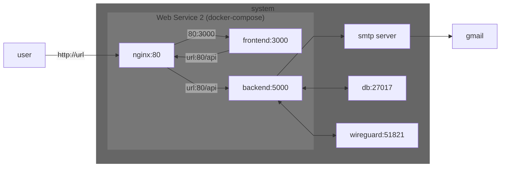

# Webservice2

## init commands

### frontend
- React.js
    ```bash
    npx create-react-app frontend
    ```

### backend
- node.js
    ```bash
    npm init -y
    npm install express
    ```


## Deployment
- docker-compose
    ```bash
    docker-compose up --build
    ```

## Diagram
